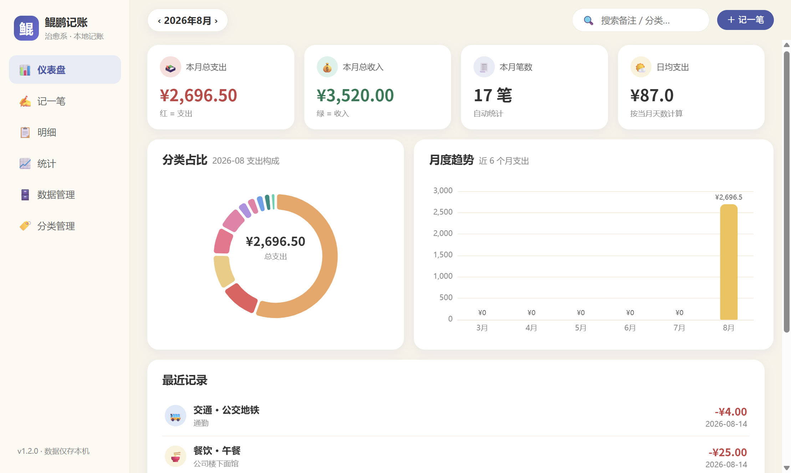
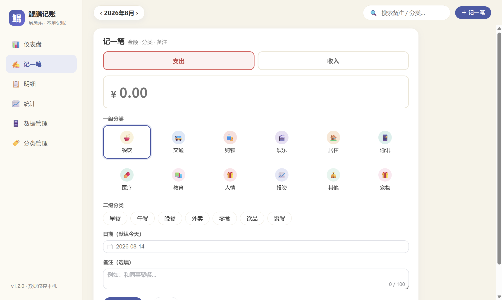
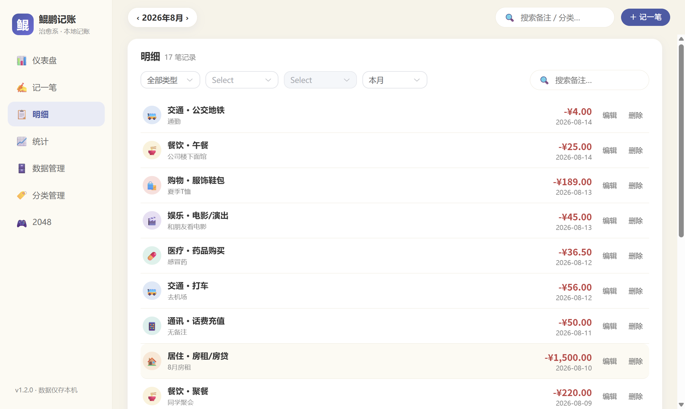
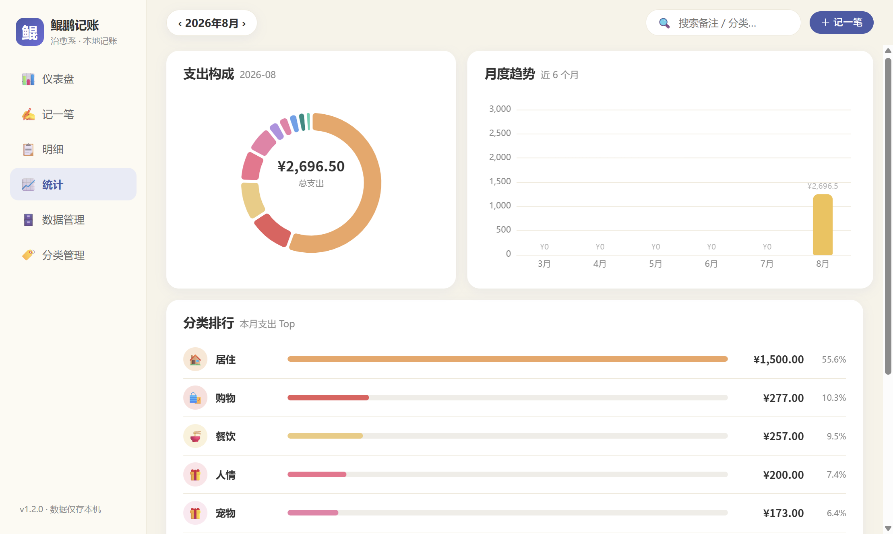
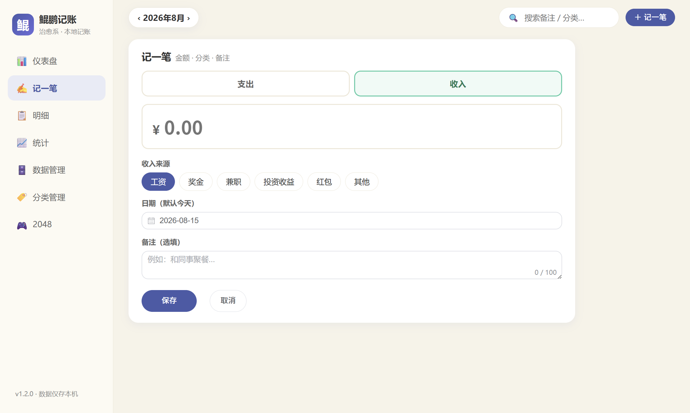

# 鲲鹏记账（KunPengBook）

一款面向个人用户的**跨平台本地记账桌面应用**（Windows / macOS）。以简洁、直观的方式记录日常收支，通过一级 + 二级分类体系清晰掌握资金流向。所有数据保存在本机 SQLite 数据库中，无需联网，注重隐私。

> 项目代号：KunPengBook · 当前版本：v1.2.0

---

## 功能特性

- **记一笔**：快速录入支出 / 收入，填写金额、日期（默认今天）、备注，并选择一级大类与二级小类
- **分类管理**：内置预置分类库（餐饮、交通、购物、娱乐、居住、通讯、医疗、教育、人情、投资、其他），并支持**自定义分类**（新增 / 改名 / 删除），预置分类保持只读
- **明细列表**：按时间倒序展示，支持按日期范围、分类筛选，按备注关键词搜索，可编辑 / 删除记录
- **统计看板**：总支出、日均支出、分类占比图表（ECharts 柱状 / 饼图），按月查看
- **数据管理**：导出 CSV / JSON 备份文件；本地数据库位置一目了然
- **隐私优先**：数据纯本地存储，无任何网络请求

## 界面预览

| 仪表盘 | 记一笔 | 明细 |
| --- | --- | --- |
|  |  |  |

| 统计 | 分类管理 | 收入录入 |
| --- | --- | --- |
|  |  |  |

## 技术栈

| 分类 | 技术 |
| --- | --- |
| 桌面框架 | Electron 37 |
| 前端框架 | Vue 3 + Vite 6 |
| UI 组件库 | Element Plus |
| 图表 | ECharts |
| 本地数据库 | SQLite（better-sqlite3） |
| 打包工具 | electron-builder |

## 快速开始

环境要求：Node.js 18+、npm。

```bash
# 1. 安装依赖
npm install

# 2. 开发模式（前端热更新 + 自动打开应用）
npm run dev

# 3. 或者：构建前端后直接运行
npm run build
npm start
```

常用命令：

| 命令 | 说明 |
| --- | --- |
| `npm run dev` | 开发模式，改代码实时刷新 |
| `npm run build` | 构建前端产物（dist/） |
| `npm start` | 运行应用（加载已构建的前端） |
| `npm run smoke` | 冒烟测试：初始化数据库并验证核心读写 |
| `npm run pack:win` | 打包 Windows 安装包 + 免安装版 + zip |
| `npm run dist:mac` | 打包 macOS dmg |

## 数据存储

记账数据保存在系统用户数据目录下的 `kunpeng.db`（SQLite 文件）：

- Windows：`%APPDATA%\鲲鹏记账\kunpeng.db`
- macOS：`~/Library/Application Support/鲲鹏记账/kunpeng.db`

应用卸载或升级不会丢失数据；如需备份，可使用应用内“数据管理 → 导出 CSV / JSON”。

## 目录结构

```text
.
├── electron/        # Electron 主进程（窗口、数据库、IPC）
├── src/             # Vue 前端源码
│   ├── components/  # 组件（分类选择、图表、统计卡片）
│   ├── views/       # 页面（记一笔、明细、统计、数据管理、分类管理）
│   └── styles/      # 全局样式
├── docs/            # 设计文档、Git 教程等
├── prototype/       # 界面原型与预览截图
├── scripts/         # 辅助脚本
├── dist/            # 前端构建产物（不提交）
├── packages/        # 打包输出目录（不提交）
└── release/         # 发布安装包（不提交）
```

## 版本历史

| 版本 | 提交 | 说明 |
| --- | --- | --- |
| `v1.0.0` | `d92615d` | 鲲鹏记账 v1.0 初始版本（Electron + Vue 3 + SQLite） |
| `v1.2.0` | `8bc50dc` | 分类自定义管理 + 收入逻辑修正 + 安装包体积优化 |

## Git 分支与协作约定

- `main`：稳定版，随时可交付
- `develop`：日常开发分支
- 版本标签用于快速定位存档点，退回方法见 [docs/git-quickstart.md](docs/git-quickstart.md)

## 许可

MIT License
